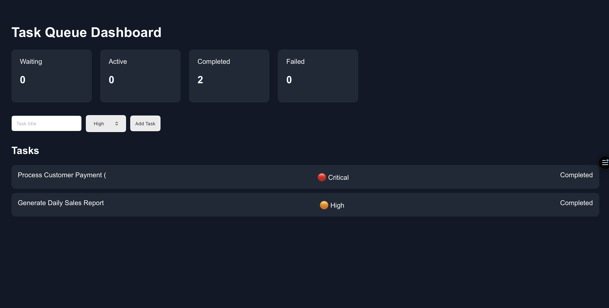

#  Task Queue System

A full-stack task queue management system built with **React, Node.js, Express, BullMQ, and Redis**. The application enables users to create, prioritize, and monitor background jobs through an interactive dashboard while demonstrating asynchronous job processing using a Redis-backed queue.

## 🚀 Live Demo

👉 **https://task-queue-system.vercel.app/**

---

## 📸 Preview

### Dashboard

<p align="center">
  
</p>

---

## ✨ Features

* Create and prioritize background tasks
* Process jobs asynchronously using BullMQ
* Redis-backed queue management
* Automatic retry mechanism for failed jobs
* Real-time task dashboard
* Queue statistics (Waiting, Active, Completed, Failed)
* Worker-based background processing

---

## 🛠️ Tech Stack

| Frontend | Backend    | Queue           |
| -------- | ---------- | --------------- |
| React    | Node.js    | BullMQ          |
| Axios    | Express.js | Redis (Upstash) |

---

## 📁 Project Structure

```text
Task-Queue-System
│
├── backend
│   ├── controllers
│   ├── routes
│   ├── queue.js
│   ├── redis.js
│   ├── worker.js
│   ├── server.js
│   └── data.js
│
├── frontend
│   ├── public
│   └── src
│
├── README.md
└── .gitignore
```

---

## 📡 API Endpoints

| Method | Endpoint | Description               |
| ------ | -------- | ------------------------- |
| POST   | `/tasks` | Create a new task         |
| GET    | `/tasks` | Retrieve all tasks        |
| GET    | `/stats` | Retrieve queue statistics |

---

## ⚙️ Local Setup

### Clone the repository

```bash
git clone https://github.com/14Sarthak/Task-Queue-System.git
cd Task-Queue-System
```

### Install dependencies

#### Backend

```bash
cd backend
npm install
```

#### Frontend

```bash
cd frontend
npm install
```

### Configure Redis

Create a `.env` file inside the **backend** directory.

```env
REDIS_URL=your_redis_connection_string
```

### Run the project

#### Backend

```bash
npm start
```

Runs on:

```text
http://127.0.0.1:9200
```

#### Frontend

```bash
npm start
```

Runs on:

```text
http://localhost:3000
```

---

## 🔮 Future Improvements

* MongoDB persistence
* User authentication
* Task deletion
* Search & filtering
* WebSocket-based live updates
* Docker support

---

## 📚 Learning Outcomes

This project demonstrates:

* Background job processing
* Queue management with BullMQ
* Redis integration
* REST API development
* Asynchronous system design
* Full-stack application deployment

---

